# Malaika Fayyaz – Portfolio

## Features

- Responsive design for all screen sizes
- Smooth transitions and interactive UI
- Built using React and Material-UI (MUI)
- Easy-to-update content structure
- Optional dark/light mode toggle (if implemented)

---

## Technologies Used

### Frontend
- React.js
- React Router
- Material-UI (MUI)

### Styling
- CSS-in-JS
- MUI Theme customization

---

## Installation & Setup

1. Clone the repository:
   `git clone https://github.com/yourusername/portfolio.git`

2. Navigate into the project folder and install dependencies:
   `cd portfolio && npm install`

3. Start the development server:
   `npm run dev`

4. Visit the local site:
   `http://localhost:3000`

---

## Screenshots

### Home Page

#### Web Mode
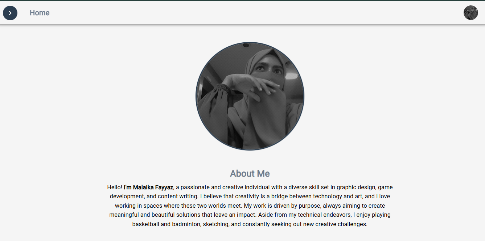

#### With SideNav
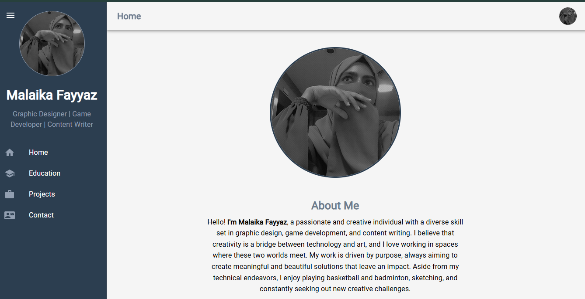

#### Mobile Mode
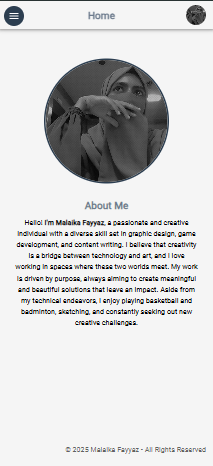

### Education Page

#### Web Mode
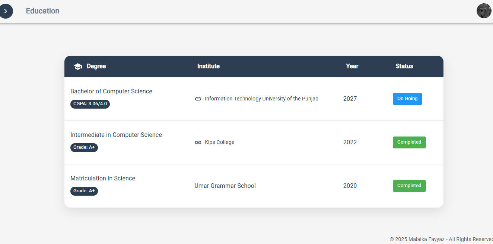

#### Mobile Mode
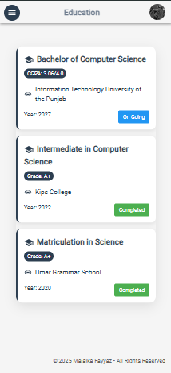

### Projects Page

#### Web Mode
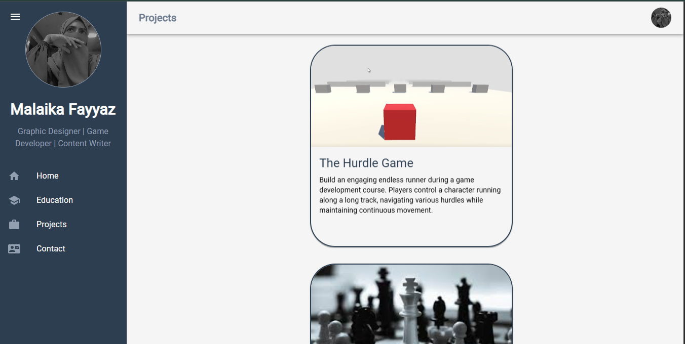
#### Without SideNav
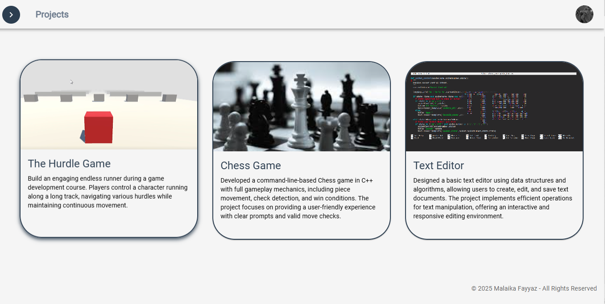
#### Mobile Mode
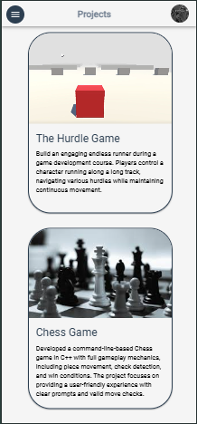

### Contact Page

#### Web mode
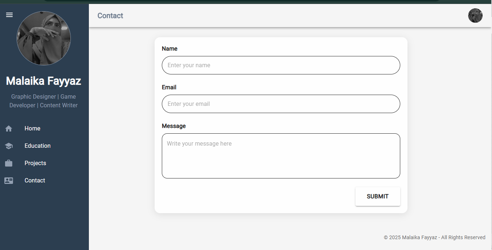

#### Mobile Mode
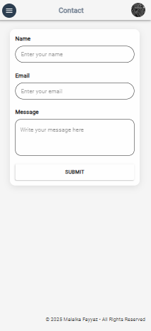

### SideNav in Mobile Mode

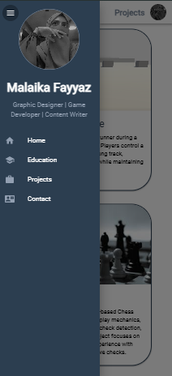

### Logout DropDown

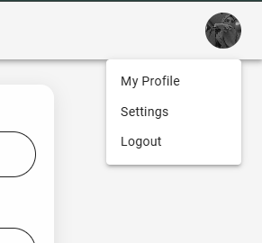

---

## Design Highlights

- **Color Scheme**: Navy blue (#2C3E50), white, and soft greys
- **Typography**: Clean, modern font stack
- **Sidebar**: Collapsible layout for better usability
- **Effects**: Hover animations, smooth transitions, and layout responsiveness

---

## Live Demo

Visit the live site: [https://react-css-portfolio-rouge.vercel.app](https://react-css-portfolio-rouge.vercel.app)

